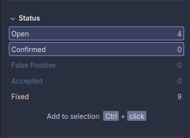

# Advanced Programming Tutorial & Assignments
## [App Link](https://exotic-ediva-advprog-838212d6.koyeb.app/)
## Muhammad Ghaza Fadhlilbaqi - 2306173321
### Reflection 1
> You already implemented two new features using Spring Boot. Check again your source code and evaluate the coding standards that you have learned in this module. Write clean code principles and secure coding practices that have been applied to your code.  If you find any mistake in your source code, please explain how to improve your code.

I've applied several clean code principles to improve readability and maintainability. I use ```meaningful names``` for functions and variables, making their purpose clear. My functions follow the ```Do one thing rule```, keeping them focused and modular. I’ve also added ```input validation``` to ensure the correct data types to be inputted in the forms.

However, I need to ```add more comments``` for better documentation for each feature of my code. Another thing to take note of is to implement ```error handling```, to ensure the code runs smoothly even when issues arise. Addressing these will make my code more reliable and maintainable.

### Reflection 2
>After writing the unit test, how do you feel? How many unit tests should be made in a class? How to make sure that our unit tests are enough to verify our program? It would be good if you learned about code coverage. Code coverage is a metric that can help you understand how much of your source is tested. If you have 100% code coverage, does that mean your code has no bugs or errors? 

Thinking on what unit tests were needed to be made was challenging at first, but it helped me understand my code better. I learned that it's not about the number of tests, but rather about testing all the important scenarios and edge cases. For example, in the ```ProductRepositoryTest```, I made sure to test not just the positive situations (like successful creation) but also to include some error cases (like trying to edit non-existent products).

I also think that 100% coverage doesn't guarantee our code to be bug-free. There could still be logical errors or edge cases I haven't thought about. It's more important to write meaningful tests that actually verify the functionality rather than just trying to test every single line of code.

>Suppose that after writing the CreateProductFunctionalTest.java along with the corresponding test case, you were asked to create another functional test suite that verifies the number of items in the product list. You decided to create a new Java class similar to the prior functional test suites with the same setup procedures and instance variables. 

Suppose i made a new functional test suite for verifying product list items, I think there would be some code smells. Logically, the new verifying product list item test was basically copying a lot of setup code from ```CreateProductFunctionalTest```, which violates the DRY (Don't Repeat Yourself) principle. This duplicate code would make maintenance harder. If we were to change how we set up tests, we'd have to change it in multiple places.

>What do you think about the cleanliness of the code of the new functional test suite? Will the new code reduce the code quality? Identify the potential clean code issues, explain the reasons, and suggest possible improvements to make the code cleaner! 

I think creating a base test class (for example ```BaseFunctionalTest```) that contains all the common setup code and helper methods, such as setting the base product name and quantity. Then all the following functional tests could extend this base class. This would make the code more maintainable and reduce duplication. Another improvement could be creating helper methods for common operations like ```createProduct``` or ```editProduct``` that could be reused across different test classes.

# Module 2
### Reflection
> List the code quality issue(s) that you fixed during the exercise and explain your strategy on fixing them.

After integrating SonarQube to my project, several code quality issues were discovered that needed fixing. The most notable issue was in `EshopApplicationTest`, where the test methods lacked proper assertions, which I fixed by implementing `assertDoesNotThrow` to verify the application's startup behavior. I also addressed code organization in `build.gradle.kts` by properly grouping the dependencies based on their usage. I chose to fix these issues since there are a bundle of them, so it allows me to clear about 5 issues out of the 12 issues present in my code (see image). These improvements helped make the codebase more reliable and easier to maintain, while also improving our SonarQube quality metrics.


>Look at your CI/CD workflows (GitHub)/pipelines (GitLab). Do you think the current implementation has met the definition of Continuous Integration and Continuous Deployment? Explain the reasons (minimum 3 sentences)!

For Continuous Integration, my GitHub Actions workflow has implemented it by automatically building and testing the code on every push, including running the test suite and SonarQube analysis. The workflow ensures code quality through automated testing and maintains consistent integration of new changes. For Continuous Deployment, I personally didn't implement it using a script, as the deployment platform I have chosen (```Koyeb```) as a feature for autodeployment built in it when we first set up the github repo we plan on deploying.

# Module 3
### Reflection
>Apply the SOLID principles you have learned. You are allowed to modify the source code according to the principles you want to implement. Please answer the following questions:
> 1) Explain what principles you apply to your project!

The project applies four SOLID principles:

```Single Responsibility Principle``` - Breaking up controllers by what they manage. ```CarController``` handles car stuff while ```ProductController``` deals with products. This way, changes to one part won't mess up the other parts.

```Open-Closed Principle``` - Putting update logic in the model classes instead of repositories. Both ```Product``` and ```Car``` have their own ```update()``` methods that repositories call instead of directly changing stuff. This lets us extend behavior without touching repository code.

```Interface Segregation Principle``` - Making smaller, focused interfaces instead of big ones. Having separate ```ProductService``` and ```CarService``` interfaces means classes only need to implement what they actually use.

```Dependency Inversion Principle``` - Using Spring's dependency injection so code depends on interfaces, not concrete classes. Controllers work with service interfaces instead of creating service objects directly.

> 2) Explain the advantages of applying SOLID principles to your project with examples.

**Improved Maintenance**: When issues arise in the car functionality, only the ```CarController``` needs to be checked without risk of affecting product-related code.

**Easier Feature Addition**: Adding validation for products (like verifying quantities to be postive numebrs) only requires modifying the ```Product.update()``` method. Repository code remains unchanged, reducing regression risks.

**Simpler Testing**: With separate interfaces, writing tests becomes much more manageable. When testing ```ProductServiceImpl```, I can focus just on product functionality without having to mock or deal with any car-related methods.

**Component Replaceability**: Changing how products are stored (like switching to a database) only requires creating a new repository implementation. The controllers remain unaffected by these implementation details.

> 3) Explain the disadvantages of not applying SOLID principles to your project with examples.

**Code Entanglement**: Without proper separation, a single controller would handle multiple items. Finding bugs would require sorting through unrelated car code.

**Difficult Modifications**: Without OCP, adding simple validation would require changing repository code directly, potentially causing unexpected issues across the system.

**Interface Bloat**: A generic ```ItemService``` interface would force product services to implement unnecessary car-related methods. This creates extra complexity and implementation burden.

**Challenging Testing**: When controllers directly instantiate services with ```new ProductServiceImpl()```, substituting test implementations becomes difficult. This complicates testing and makes the system more rigid.

# Module 4
### Reflection
>Reflect based on Percival (2017) proposed self-reflective questions (in “Principles and Best Practice of Testing” submodule, chapter “Evaluating Your Testing Objectives”), whether this TDD flow is useful enough for you or not. If not, explain things that you need to do next time you make more tests.

In my opinion, the Test Driven Development flow has it's ups and downs. On one hand, if we have a clear idea on the project we are going to make, using the TDD workflow allows us to test several input scenarios for the features. That would allow us to constantly evaluate if our code is correct or not, saving us the trouble of having issues later down the line. On the otherhand, writing up tests without knowing what we are going to build could waste more time, since we have to think of the technical aspects of the feature in the tests without having the actual features.

>You have created unit tests in Tutorial. Now reflect whether your tests have successfully followed F.I.R.S.T. principle or not. If not, explain things that you need to do the next time you create more tests.

For the F (FAST) aspect, I am still unsure since my tests are only conducted on a small scale, and I am not certain whether they would be considered fast when compared to running thousands of unit tests.

For the I (Isolated) aspect, I believe my tests adhere to this principle, as each test runs independently without affecting others.

For the R (Repeatable) aspect, the tests I created are not dependent on the environment in which they are executed and use independent data, meaning they already align with this principle.

For the S (Self-validating) aspect, the tests are fully automated and can be executed in IntelliJ, eliminating the need for manual validation of their results.

For the T (Timely) aspect, I recognize that not all cases are covered. In the future, if I have more time, I will work on making more tests to ensure all scenarios are properly tested.
